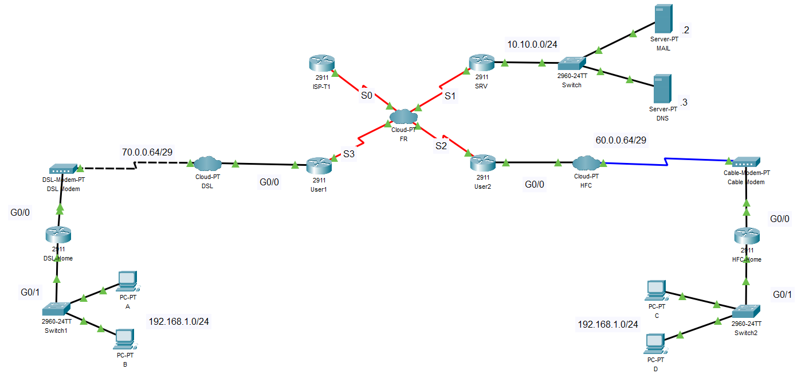

# Network Configuration Project

## Description
Network configuration project completed as part of my university course **"Connecting Networks."** This project simulates an ISP setup using Cisco Packet Tracer, featuring router configurations, DHCP server setup, static NAT, and Frame Relay connections to demonstrate effective network management and connectivity.

## Key Features
- Configured routers with static IP addresses and hostnames.
- Set up DHCP servers for dynamic IP allocation.
- Implemented static NAT for internal IP mapping to public addresses.
- Established Frame Relay connections for point-to-point and multipoint links.
- Enabled Telnet access for remote management of devices.

## Technologies Used
- Cisco Packet Tracer

## Images
**Logical Scheme**   
   
